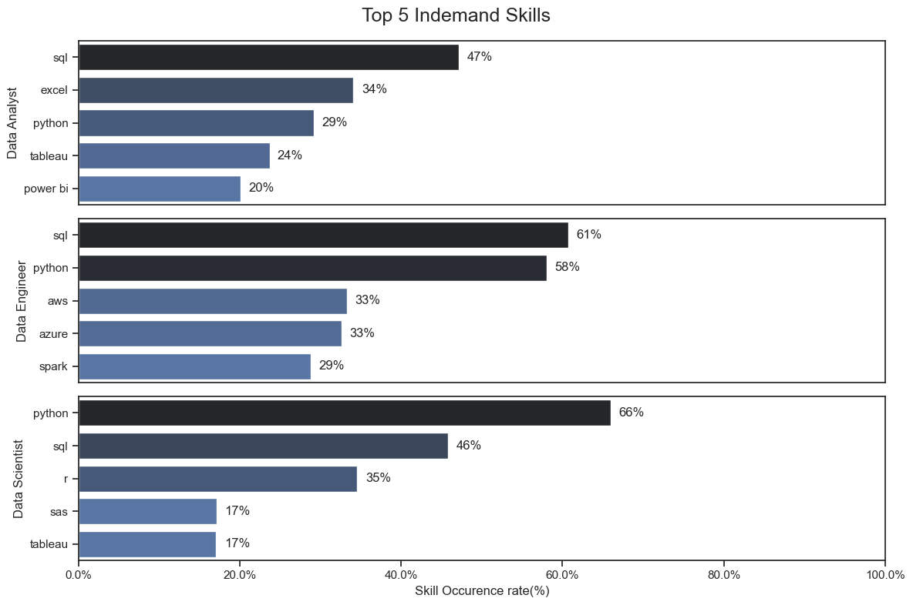
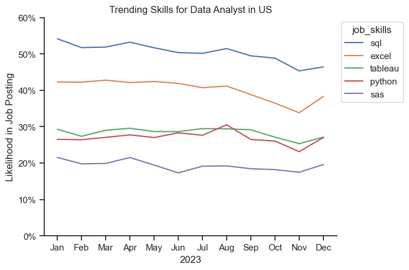
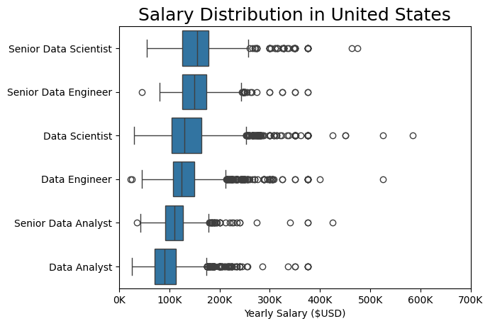
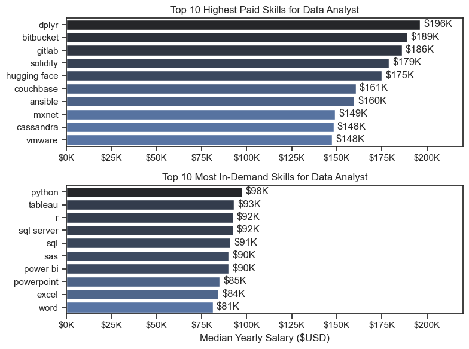
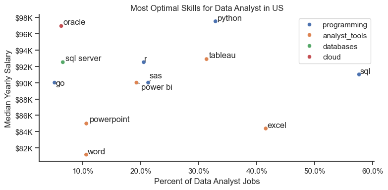

# Overview

Welcome to my Analysis of the data job market, focusing on data analyst roles. This project was created out of desire to understand the job market more effectively. This project examines the highest-paying and most sought-after skills, offering insights into securing optimal job prospects in data analysis.

Data Source: 
https://huggingface.co/datasets/lukebarousse/data_jobs

# The Questions

Below are the questions I want to answer in my project:

1. What are the skills most in demand for the top 3 most popular data roles?
2. How are in-demand skills trending for Data Analysts?
3. How well do jobs and skills pay for Data Analysts?
4. What are the optimal skills for data analysts to learn? (High Demand and High Paying) 

# Tools I Used

For my deep dive into the data analyst job market, I harnessed the power of several key tools:

- **Python:** The backbone of my analysis, allowing me to analyze the data and find critical insights.I also used the following Python libraries:
    - **Pandas Library:** This was used to analyze the data. 
    - **Matplotlib Library:** I visualized the data.
    - **Seaborn Library:** Helped me create more advanced visuals. 
- **Jupyter Notebooks:** The tool I used to run my Python scripts which let me easily include my notes and analysis.
- **Visual Studio Code:** My go-to for executing my Python scripts.
- **Git & GitHub:** Essential for version control and sharing my Python code and analysis, ensuring collaboration and project tracking.

# Data Preparation and Cleanup

This section outlines the steps taken to prepare the data for analysis, ensuring accuracy and usability.

## Import & Clean Up Data

I start by importing necessary libraries and loading the dataset, followed by initial data cleaning tasks to ensure data quality.

```python
# Importing Libraries
import ast
import pandas as pd
import seaborn as sns
from datasets import load_dataset
import matplotlib.pyplot as plt  

# Loading Data
dataset = load_dataset('lukebarousse/data_jobs')
df = dataset['train'].to_pandas()

# Data Cleanup
df['job_posted_date'] = pd.to_datetime(df['job_posted_date'])
df['job_skills'] = df['job_skills'].apply(lambda x: ast.literal_eval(x) if pd.notna(x) else x)
```

## Filter US Jobs

To focus my analysis on the U.S. job market, I apply filters to the dataset, narrowing down to roles based in the United States.

```python
df_US = df[df['job_country'] == 'United States']

```

# The Analysis

## 1. What are the most indemand skills for the top 3 most popular data roles?

To find the most indemand skills for the top 3 roles, I filtered out those positions by which onces were the most popular, and get the top 5 skills for the top 3 roles. By doing this it will show which skill should focus on based on the role.

Refer to Jupyter Notebook for the detailed steps: [2_Skills_Demand.ipynb](./3_Project/2_Skills_Demand.ipynb)

### Visualize Data

```python
fig, ax = plt.subplots(len(top_jobs), 1, figsize= (12,8))
sns.set_theme(style='ticks')

for i,job in enumerate(top_jobs):
    top_skills = merge_skill_job[merge_skill_job['job_title_short'] ==  job].head(5)
    sns.barplot(
        data= top_skills
        ,x= 'skill_perc'
        ,y= 'job_skills'
        ,ax = ax[i]
        ,hue= 'skill_perc'
        ,palette= 'dark:b_r'
        ,legend= False
        )
    ax[i].set_ylabel(f'{job}')
    ax[i].set_xlim(0,100)
    
    if i < len(top_jobs)-1:
        ax[i].set_xlabel('')
        ax[i].set_xticks([])
    else: 
        ax[i].set_xlabel('Skill Occurence rate(%)')
        ax[i].xaxis.set_major_formatter(plt.FuncFormatter(lambda x,i: f'{x}%'))

    for v, n in enumerate(top_skills['skill_perc']):
        ax[i].text(x= n+1,y= v,s= f'{n:.0f}%',va= 'center')

fig.suptitle('Top 5 Indemand Skills', fontsize= 18)
fig.tight_layout()

plt.show()
```

### Results

*Bar graph visualizing the In-demand skills for trending jobs in 2023.*

### Insights

- Python is highly requested across the roles, but prominently for Data Scientists(66%).

- SQL is the most requested skill, highly demanded across all three roles.

- Data Engineer requires more specialized technical skills (AWS, Azure, Spark) compared to Data Analyst and Data Scientist who are expected to be proficient in more general data management and data visualization tools (SQL, Excel, Tableau).

## 2. How are In-demand skills trending for Data Analysts in United States?

To identify the trend of in-demand skills for Data Analyst role in United States, I filtered the dataset for Posted Jobs of Data Analyst in United States then get the monthly posted jobs count and compare it to monthly skill counts to get the likelihood of skills in job posting.

Refer to Jupyter Notebook for the detailed steps: [3_Skill_Trend.ipynb](./3_Project/3_Skill_Trend.ipynb)

### Visualize Data

```python
ax = sns.lineplot(
        data=skill_perc[top_skills_list]
        ,dashes= False
        )
sns.set_theme(style= 'ticks')
sns.move_legend(ax, "upper left", bbox_to_anchor=(1,1))
sns.despine()
ax.set_title('Trending Skills for Data Analyst in US')
ax.set_xlabel(2023)
ax.set_ylabel('Likelihood in Job Posting')
ax.set_ylim(0,60)
ax.yaxis.set_major_formatter(plt.FuncFormatter(lambda x,i: f'{x:.0f}%'))
```

### Results


*Line chart visualizing the monthly trend of top skills for Data Analyst in US in 2023.*

### Insights

- SQL remains the indemand skills throughout hte year, altough it shows a gradual decrease in demand.

- Excel experience a decrease from Sep to Nov but increased in Dec.

- Both Python and Tableau show relatively stable demand throughout the year with some fluctuations.

- Although SAS is less demanded compared to the others it also show stable demand throughout the year.

- There's a sudden increase of demand in December for all trending skills.

## 3. How well do jobs and skills pay for Data Analysts?
### Job Comparison
Compare the salary distribution of Data Analyst to other indemand job.

Refer to Jupyter Notebook for the detailed steps: [4_Salary_Analysis](./3_Project/4_Salary_Analysis.ipynb)

### Visualize Data

```python
job_order = df_US_top6.groupby('job_title_short')['salary_year_avg'].median().sort_values(ascending=False).index

sns.boxplot(data=df_US_top6,x='salary_year_avg',y='job_title_short', order=job_order)

ax = plt.gca()
ax.set_xlim(0,700_000)
ax.xaxis.set_major_formatter(plt.FuncFormatter(lambda x,i : f'{int(x/1000)}K'))
ax.set_xlabel('Yearly Salary ($USD)')
ax.set_ylabel('')
ax.set_title('Salary Distribution in United States', fontsize= 18)
plt.show()
```

### Results


*Boxplot visualizing the distribution of salary for in-demand jobs in United States.*

### Insights

- Senior Roles for Data Scientist and Data Engineer have the hight yearly salary compared to all.

- Senior role for data analyst have a lower median yearly salary compared to Data Scientist and Data Engineer.

- Median salaries increases with the seniority and specialization of the roles.

- Median salaries increases with the seniority and specialization of the roles.
#### Skills Comparison

Determine the top-paying and most in-demand skills for Data Analysts, and identify which ones are most valuable to learn.

Refer to Jupyter Notebook for the detailed steps: [4_Salary_Analysis](./3_Project/4_Salary_Analysis.ipynb)

### Visualize Data

```python
fig, ax = plt.subplots(2, 1, figsize= (8,6))
sns.set_theme(style='ticks')

sns.barplot(
    data= df_DA_top10_pay 
    ,x='median',y='job_skills'
    ,ax=ax[0] 
    ,hue= 'median' 
    ,palette='dark:b_r' 
    ,legend= False
    )
ax[0].set_title('Top 10 Highest Paid Skills for Data Analyst')
ax[0].set_xlabel('')
ax[0].set_ylabel('')
ax[0].set_xlim(0,220_000)
ax[0].xaxis.set_major_formatter(plt.FuncFormatter(lambda x,i: f'${x/1000:.0f}K'))
for i,v in enumerate(df_DA_top10_pay['median']):
    ax[0].text(v+2000,i,f'${(v/1000):.0f}K' ,va='center')

sns.barplot(
    data= df_DA_top10_popular 
    ,x='median',y='job_skills'
    ,ax=ax[1] 
    ,hue= 'median' 
    ,palette='dark:b_r' 
    ,legend= False
    )
ax[1].set_title('Top 10 Most In-Demand Skills for Data Analyst')
ax[1].set_xlabel('Median Yearly Salary ($USD)')
ax[1].set_ylabel('')
ax[1].set_xlim(0,220_000)
ax[1].xaxis.set_major_formatter(plt.FuncFormatter(lambda x,i: f'${x/1000:.0f}K'))
for i,v in enumerate(df_DA_top10_popular['median']):
    ax[1].text(v+2000,i,f'${(v/1000):.0f}K' ,va='center')

fig.tight_layout()
plt.show()
```
### Results


*Bar chart representing the highest paying skills and most in-demand skills for Data analyst.*

### Insights

- Tools like `dplyr`, `bitbucket`, `gitlab`, and `solidity` are not universally required, but when they are, they pay very well, often due to a combination of scarcity and impact. These are “specialist” skills—less common, more technical, and often not beginner-friendly, but highly rewarding.

- Skills like `Python`, `SQL`, `Excel`, and `Power BI` are the bread and butter of data analysis. Their salaries are more modest but reflect widespread usage and continuous demand. These are “generalist” skills—easier to learn, widely needed, and a must-have for any data analyst.

### Skill Comparison

Using scatterplot identify which skill is worth investing. Determine the median yearly salary and the demand status of skills.

Refer to jupyter notebook for detailed steps: [5_Optimal_Skills](./3_Project/5_Optimal_Skills.ipynb)

### Visualise Data
```python
df_plot = df_DA_skill_demand.merge(df_tech_explode, how='left', left_on='job_skills', right_on='skills')

from adjustText import adjust_text

plt.figure(figsize=(8,4))

sns.scatterplot(data=df_plot, x='skill_percent', y='median_salary',hue= 'technology')
sns.despine()
sns.set_theme(style='ticks')

texts = []
for i,skill in enumerate(df_DA_skill_demand.index):
    texts.append(
        plt.text(
            x= df_DA_skill_demand['skill_percent'].iloc[i]
            ,y= df_DA_skill_demand['median_salary'].iloc[i]
            ,s= skill
        )
    )

adjust_text(texts,arrowprops=dict(arrowstyle='->',color='gray'))

plt.xlabel('Percent of Data Analyst Jobs')
plt.ylabel('Median Yearly Salary')
plt.title('Most Optimal Skills for Data Analyst in US' ,fontsize=12)
plt.legend(title=False)
ax=plt.gca()
ax.xaxis.set_major_formatter(plt.FuncFormatter(lambda x,i: f'{x}%'))
ax.yaxis.set_major_formatter(plt.FuncFormatter(lambda y,i: f'${y/1000:,.0f}K'))
plt.tight_layout()
plt.show()
```

### Results

*Scatterplot shows the connection between the median yearly salary and the demand rate of each skills for Data Analyst in United States*

### Insights

- `Python`, `SQL`, and `Tableau` offer the best mix of high demand and strong salaries, making them the most optimal core skills for data analysts.

- `Excel` and basic office tools are widely used but offer lower pay and are not major differentiators in the job market.

- Specialized tools like `Oracle` and `Go` offer high salaries but are niche, ideal for standing out in advanced or industry-specific roles.

# What I Learned

Throughout this project, I deepened my understanding of the data analyst job market and enhanced my technical skills in Python, especially in data manipulation and visualization. Here are a few specific things I learned:

- **Advanced Python Usage**: Utilizing libraries such as Pandas for data manipulation, Seaborn and Matplotlib for data visualization, and other libraries helped me perform complex data analysis tasks more efficiently.
- **Data Cleaning Importance**: I learned that thorough data cleaning and preparation are crucial before any analysis can be conducted, ensuring the accuracy of insights derived from the data.
- **Strategic Skill Analysis**: The project emphasized the importance of aligning one's skills with market demand. Understanding the relationship between skill demand, salary, and job availability allows for more strategic career planning in the tech industry.


# Insights

This project provided several general insights into the data job market for analysts:

- **Skill Demand and Salary Correlation**: There is a clear correlation between the demand for specific skills and the salaries these skills command. Advanced and specialized skills like Python and Oracle often lead to higher salaries.
- **Market Trends**: There are changing trends in skill demand, highlighting the dynamic nature of the data job market. Keeping up with these trends is essential for career growth in data analytics.
- **Economic Value of Skills**: Understanding which skills are both in-demand and well-compensated can guide data analysts in prioritizing learning to maximize their economic returns.


# Challenges I Faced

This project was not without its challenges, but it provided good learning opportunities:

- **Data Inconsistencies**: Handling missing or inconsistent data entries requires careful consideration and thorough data-cleaning techniques to ensure the integrity of the analysis.
- **Complex Data Visualization**: Designing effective visual representations of complex datasets was challenging but critical for conveying insights clearly and compellingly.
- **Balancing Breadth and Depth**: Deciding how deeply to dive into each analysis while maintaining a broad overview of the data landscape required constant balancing to ensure comprehensive coverage without getting lost in details.


# Conclusion

This exploration into the data analyst job market has been incredibly informative, highlighting the critical skills and trends that shape this evolving field. The insights I got enhance my understanding and provide actionable guidance for anyone looking to advance their career in data analytics. As the market continues to change, ongoing analysis will be essential to stay ahead in data analytics. This project is a good foundation for future explorations and underscores the importance of continuous learning and adaptation in the data field.


